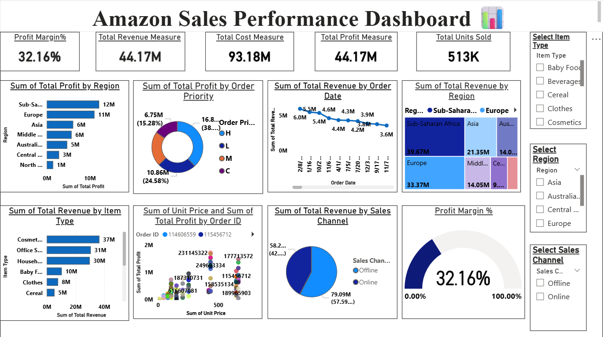

# Amazon Sales Performance Dashboard

## About the Project

This is a Power BI dashboard project created to analyze sales performance using an Amazon sales dataset.

The main aim of this project is to understand sales, revenue, cost, profit, regions, item types, order priorities, and sales channels through interactive visualizations.

I worked on the data preparation, created the required DAX measures, and designed the dashboard in Power BI.

## Tools Used

- Power BI
- Power Query
- DAX
- CSV Dataset

## Dataset

The dataset contains 100 sales records with information such as:

- Region
- Country
- Item Type
- Sales Channel
- Order Priority
- Order Date
- Order ID
- Ship Date
- Units Sold
- Unit Price
- Unit Cost
- Total Revenue
- Total Cost
- Total Profit

The dataset is used for learning and portfolio purposes.

## Data Preparation

Before creating the dashboard, I checked and prepared the data by:

- Checking the structure of the dataset
- Checking data types
- Checking missing values
- Checking duplicate records
- Converting the date columns into the correct format
- Reviewing revenue, cost, and profit values
- Creating DAX measures for the main KPIs

## KPIs Created

The dashboard includes the following key performance indicators:

- Total Revenue
- Total Cost
- Total Profit
- Total Units Sold
- Profit Margin %

## Dashboard Features

The dashboard contains different visualizations to understand the sales data:

- Profit by Region
- Profit by Order Priority
- Revenue by Order Date
- Revenue by Region
- Revenue by Item Type
- Revenue by Sales Channel
- Revenue vs Profit
- Profit Margin Gauge

I also added interactive slicers for:

- Region
- Item Type
- Sales Channel

These slicers allow users to filter the dashboard and explore the data based on their requirements.

## Key Insights

From the dashboard, we can understand:

- Which regions contribute more to profit and revenue
- Which item types generate higher revenue
- How revenue changes over different order dates
- The contribution of online and offline sales channels
- How revenue and profit are related
- The overall profit margin of the sales data

## Dashboard Preview

## What I Learned

This project helped me get practical experience with Power BI and data analysis.

While working on this project, I learned how to:

- Prepare data using Power Query
- Create DAX measures
- Create KPI cards
- Choose suitable charts for different analysis
- Add slicers and make a dashboard interactive
- Arrange and format a dashboard
- Present data and insights in a simple visual way

## Conclusion

This project gave me hands-on experience in converting raw sales data into an interactive Power BI dashboard.

It also helped me understand how data visualization can be used to identify useful patterns and business insights from sales data.

## Author

**Meghana Katta**

B.Tech - CSE (AI & DS)

GitHub: [meghana2457](https://github.com/meghana2457)
